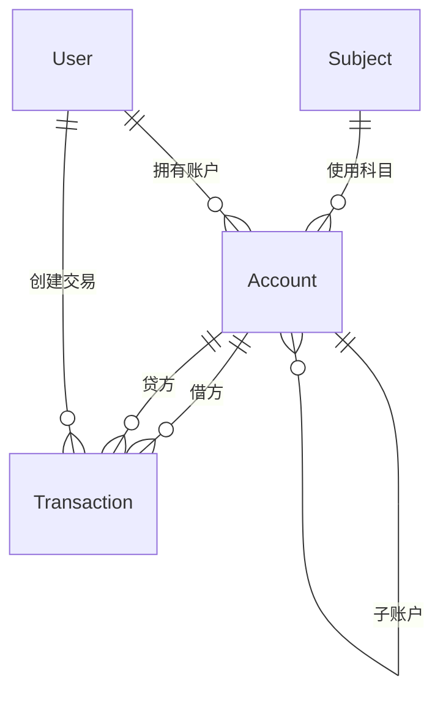

# 个人复式记账系统 - MVP版本设计文档

## 1. MVP版本功能范围

### 1.1 核心功能
- ✅ 复式记账基础功能（借贷记账）
- ✅ 基础账户管理
- ✅ 预设会计科目
- ✅ 交易记录管理
- ✅ 基础财务报表
- ✅ 简单数据可视化

### 1.2 暂不包含功能
- ❌ 云同步功能
- ❌ 多币种支持
- ❌ 高级预算管理
- ❌ AI智能建议
- ❌ 移动端APP

## 2. 数据模型设计

### 2.1 核心实体关系



### 2.2 数据表设计

#### 2.2.1 用户表 (users)
```sql
CREATE TABLE users (
    id INTEGER PRIMARY KEY AUTOINCREMENT,
    username VARCHAR(50) UNIQUE NOT NULL,
    email VARCHAR(100) UNIQUE NOT NULL,
    password_hash VARCHAR(255) NOT NULL,
    created_at DATETIME DEFAULT CURRENT_TIMESTAMP,
    updated_at DATETIME DEFAULT CURRENT_TIMESTAMP
);
```

#### 2.2.2 账户表 (accounts)
```sql
CREATE TABLE accounts (
    id INTEGER PRIMARY KEY AUTOINCREMENT,
    user_id INTEGER NOT NULL,
    name VARCHAR(100) NOT NULL,
    account_type VARCHAR(20) NOT NULL, -- asset, liability, equity, income, expense
    parent_id INTEGER, -- 父账户ID，支持层级结构
    subject_id INTEGER, -- 会计科目ID
    balance DECIMAL(15,2) DEFAULT 0,
    currency VARCHAR(10) DEFAULT 'CNY',
    is_active BOOLEAN DEFAULT true,
    created_at DATETIME DEFAULT CURRENT_TIMESTAMP,
    updated_at DATETIME DEFAULT CURRENT_TIMESTAMP,
    FOREIGN KEY (user_id) REFERENCES users(id),
    FOREIGN KEY (parent_id) REFERENCES accounts(id)
);
```

#### 2.2.3 会计科目表 (subjects)
```sql
CREATE TABLE subjects (
    id INTEGER PRIMARY KEY AUTOINCREMENT,
    code VARCHAR(20) NOT NULL,
    name VARCHAR(100) NOT NULL,
    subject_type VARCHAR(20) NOT NULL, -- asset, liability, equity, income, expense
    parent_id INTEGER,
    description TEXT,
    is_system BOOLEAN DEFAULT false, -- 是否系统预设
    created_at DATETIME DEFAULT CURRENT_TIMESTAMP,
    FOREIGN KEY (parent_id) REFERENCES subjects(id)
);
```

#### 2.2.4 交易表 (transactions)
```sql
CREATE TABLE transactions (
    id INTEGER PRIMARY KEY AUTOINCREMENT,
    user_id INTEGER NOT NULL,
    transaction_date DATE NOT NULL,
    description TEXT,
    reference_no VARCHAR(50), -- 参考编号
    status VARCHAR(20) DEFAULT 'posted', -- draft, posted, void
    created_at DATETIME DEFAULT CURRENT_TIMESTAMP,
    updated_at DATETIME DEFAULT CURRENT_TIMESTAMP,
    FOREIGN KEY (user_id) REFERENCES users(id)
);
```

#### 2.2.5 交易分录表 (transaction_entries)
```sql
CREATE TABLE transaction_entries (
    id INTEGER PRIMARY KEY AUTOINCREMENT,
    transaction_id INTEGER NOT NULL,
    account_id INTEGER NOT NULL,
    entry_type VARCHAR(10) NOT NULL, -- debit, credit
    amount DECIMAL(15,2) NOT NULL,
    description TEXT,
    line_no INTEGER NOT NULL, -- 分录行号
    created_at DATETIME DEFAULT CURRENT_TIMESTAMP,
    FOREIGN KEY (transaction_id) REFERENCES transactions(id),
    FOREIGN KEY (account_id) REFERENCES accounts(id)
);
```

### 2.3 预设会计科目数据

```sql
-- 资产类科目
INSERT INTO subjects (code, name, subject_type, description, is_system) VALUES
('1001', '现金', 'asset', '库存现金', true),
('1002', '银行存款', 'asset', '存入银行的各种款项', true),
('1121', '应收账款', 'asset', '应收尚未收回的款项', true),
('1131', '其他应收款', 'asset', '除应收账款外的其他应收款项', true),
('1401', '固定资产', 'asset', '使用期限超过一年的有形资产', true);

-- 负债类科目
INSERT INTO subjects (code, name, subject_type, description, is_system) VALUES
('2001', '短期借款', 'liability', '期限在一年内的借款', true),
('2201', '应付账款', 'liability', '应付未付的款项', true),
('2202', '其他应付款', 'liability', '除应付账款外的其他应付款项', true),
('2211', '应付工资', 'liability', '应付未付的工资', true),
('2301', '长期借款', 'liability', '期限超过一年的借款', true);

-- 权益类科目
INSERT INTO subjects (code, name, subject_type, description, is_system) VALUES
('3001', '实收资本', 'equity', '实际收到的资本金', true),
('3101', '本年利润', 'equity', '当年实现的净利润', true),
('3102', '利润分配', 'equity', '利润的分配（或亏损的弥补）', true);

-- 收入类科目
INSERT INTO subjects (code, name, subject_type, description, is_system) VALUES
('4001', '主营业务收入', 'income', '主要经营业务产生的收入', true),
('4011', '其他业务收入', 'income', '除主营业务外的其他收入', true),
('4031', '营业外收入', 'income', '与生产经营无直接关系的收入', true),
('4041', '投资收益', 'income', '对外投资获得的收益', true);

-- 费用类科目
INSERT INTO subjects (code, name, subject_type, description, is_system) VALUES
('5001', '主营业务成本', 'expense', '主要经营业务发生的成本', true),
('5011', '其他业务成本', 'expense', '除主营业务外的其他成本', true),
('5031', '营业外支出', 'expense', '与生产经营无直接关系的支出', true),
('5041', '销售费用', 'expense', '销售过程中发生的费用', true),
('5051', '管理费用', 'expense', '组织管理生产经营发生的费用', true),
('5061', '财务费用', 'expense', '筹集生产经营资金发生的费用', true);
```

## 3. 技术架构设计

### 3.1 整体架构

```
┌─────────────────────────────────────────────────┐
│                  Frontend Layer                 │
│  React 18 + TypeScript + Ant Design + ECharts   │
└─────────────────────────────────────────────────┘
                      │ HTTP/WebSocket
                      ▼
┌─────────────────────────────────────────────────┐
│                   API Gateway                    │
│              Express.js + Middleware             │
└─────────────────────────────────────────────────┘
                      │
                      ▼
┌─────────────────────────────────────────────────┐
│                Business Logic Layer              │
│           Services + Validators + Utils          │
└─────────────────────────────────────────────────┘
                      │
                      ▼
┌─────────────────────────────────────────────────┐
│                 Data Access Layer                │
│              Prisma ORM + SQLite                 │
└─────────────────────────────────────────────────┘
```

### 3.2 前端架构

#### 目录结构
```
frontend/
├── src/
│   ├── components/          # 可复用组件
│   │   ├── common/         # 通用组件
│   │   ├── accounting/     # 记账相关组件
│   │   └── charts/         # 图表组件
│   ├── pages/              # 页面组件
│   │   ├── Dashboard/      # 仪表板
│   │   ├── Accounts/       # 账户管理
│   │   ├── Transactions/   # 交易管理
│   │   ├── Subjects/       # 科目管理
│   │   └── Reports/        # 报表中心
│   ├── services/           # API服务
│   ├── hooks/              # 自定义Hooks
│   ├── store/              # 状态管理
│   ├── types/              # TypeScript类型
│   ├── utils/              # 工具函数
│   └── styles/             # 样式文件
```

#### 状态管理
```typescript
// 使用Zustand进行状态管理
interface AppState {
  // 用户状态
  user: User | null;
  
  // 账户状态
  accounts: Account[];
  currentAccount: Account | null;
  
  // 交易状态
  transactions: Transaction[];
  filteredTransactions: Transaction[];
  
  // 科目状态
  subjects: Subject[];
  
  // 操作
  setUser: (user: User | null) => void;
  setAccounts: (accounts: Account[]) => void;
  addTransaction: (transaction: Transaction) => void;
  updateTransaction: (id: string, data: Partial<Transaction>) => void;
}
```

### 3.3 后端架构

#### 目录结构
```
backend/
├── src/
│   ├── routes/             # 路由定义
│   │   ├── auth.routes.ts
│   │   ├── account.routes.ts
│   │   ├── transaction.routes.ts
│   │   └── report.routes.ts
│   ├── controllers/        # 控制器
│   │   ├── auth.controller.ts
│   │   ├── account.controller.ts
│   │   ├── transaction.controller.ts
│   │   └── report.controller.ts
│   ├── services/           # 业务逻辑
│   │   ├── accounting.service.ts
│   │   ├── transaction.service.ts
│   │   └── report.service.ts
│   ├── models/             # 数据模型
│   │   ├── user.model.ts
│   │   ├── account.model.ts
│   │   └── transaction.model.ts
│   ├── middleware/         # 中间件
│   │   ├── auth.middleware.ts
│   │   ├── validation.middleware.ts
│   │   └── error.middleware.ts
│   ├── utils/              # 工具函数
│   │   ├── accounting.util.ts
│   │   └── date.util.ts
│   ├── config/             # 配置文件
│   │   ├── database.config.ts
│   │   └── app.config.ts
│   └── index.ts            # 入口文件
```

## 4. API接口设计

### 4.1 认证相关
```typescript
POST   /api/auth/register     // 用户注册
POST   /api/auth/login        // 用户登录
POST   /api/auth/logout       // 用户登出
GET    /api/auth/profile      // 获取用户信息
PUT    /api/auth/profile      // 更新用户信息
```

### 4.2 账户管理
```typescript
GET    /api/accounts          // 获取账户列表
GET    /api/accounts/:id      // 获取账户详情
POST   /api/accounts          // 创建账户
PUT    /api/accounts/:id      // 更新账户
DELETE /api/accounts/:id      // 删除账户
GET    /api/accounts/:id/balance  // 获取账户余额
```

### 4.3 交易管理
```typescript
GET    /api/transactions          // 获取交易列表
GET    /api/transactions/:id      // 获取交易详情
POST   /api/transactions          // 创建交易
PUT    /api/transactions/:id      // 更新交易
DELETE /api/transactions/:id      // 删除交易
POST   /api/transactions/:id/post // 过账交易
POST   /api/transactions/:id/void // 冲销交易
```

### 4.4 科目管理
```typescript
GET    /api/subjects          // 获取科目列表
GET    /api/subjects/tree     // 获取科目树
GET    /api/subjects/:id      // 获取科目详情
POST   /api/subjects          // 创建科目（管理员）
PUT    /api/subjects/:id      // 更新科目
DELETE /api/subjects/:id      // 删除科目
```

### 4.5 报表查询
```typescript
GET    /api/reports/balance-sheet      // 资产负债表
GET    /api/reports/income-statement   // 损益表
GET    /api/reports/trial-balance      // 试算平衡表
GET    /api/reports/cash-flow          // 现金流量表
GET    /api/reports/account-ledger/:accountId  // 账户明细账
```

### 4.6 数据分析
```typescript
GET    /api/analytics/overview         // 财务概览
GET    /api/analytics/income-expense   // 收支分析
GET    /api/analytics/trends           // 趋势分析
GET    /api/analytics/account-balance  // 账户余额分析
```

## 5. 前端页面设计

### 5.1 页面结构

#### 5.1.1 主布局 (Layout)
```
┌─────────────────────────────────────────────┐
│  Header: Logo | 用户信息 | 设置             │
├─────────┬───────────────────────────────────┤
│         │                                   │
│ Sidebar │                                   │
│         │     Main Content                  │
│ - 仪表板│                                   │
│ - 账户  │                                   │
│ - 记账  │                                   │
│ - 科目  │                                   │
│ - 报表  │                                   │
│         │                                   │
└─────────┴───────────────────────────────────┘
```

#### 5.1.2 仪表板页面
```typescript
// Dashboard.tsx
interface DashboardData {
  overview: {
    totalAssets: number;
    totalLiabilities: number;
    netWorth: number;
    monthlyIncome: number;
    monthlyExpenses: number;
  };
  recentTransactions: Transaction[];
  incomeExpenseChart: ChartData;
  accountBalanceChart: ChartData;
}
```

#### 5.1.3 记账页面
```typescript
// TransactionForm.tsx
interface TransactionFormData {
  transactionDate: Date;
  description: string;
  entries: {
    accountId: string;
    entryType: 'debit' | 'credit';
    amount: number;
    description?: string;
  }[];
}
```

#### 5.1.4 账户管理页面
```typescript
// AccountManagement.tsx
interface AccountListData {
  accounts: Account[];
  accountTree: AccountNode[];
  totalBalance: number;
}
```

### 5.2 核心组件设计

#### 5.2.1 记账表单组件
```typescript
// TransactionForm.tsx
const TransactionForm: React.FC<Props> = () => {
  const [formData, setFormData] = useState<TransactionFormData>();
  const [entries, setEntries] = useState<Entry[]>([
    { accountId: '', entryType: 'debit', amount: 0 }
  ]);
  
  // 验证借贷平衡
  const validateBalance = () => {
    const debitTotal = entries
      .filter(e => e.entryType === 'debit')
      .reduce((sum, e) => sum + e.amount, 0);
    const creditTotal = entries
      .filter(e => e.entryType === 'credit')
      .reduce((sum, e) => sum + e.amount, 0);
    return debitTotal === creditTotal;
  };
};
```

#### 5.2.2 账户选择组件
```typescript
// AccountSelector.tsx
const AccountSelector: React.FC<AccountSelectorProps> = ({
  value,
  onChange,
  accountType,
  excludeIds
}) => {
  const [accounts, setAccounts] = useState<Account[]>([]);
  const [treeData, setTreeData] = useState<TreeNode[]>([]);
  
  // 懒加载账户树
  const loadAccounts = async () => {
    const response = await accountApi.getAccounts({ type: accountType });
    setAccounts(response.data);
    setTreeData(buildAccountTree(response.data));
  };
};
```

#### 5.2.3 财务报表组件
```typescript
// FinancialReports.tsx
const BalanceSheet: React.FC = () => {
  const [reportData, setReportData] = useState<BalanceSheetData>();
  
  const loadReport = async (asOfDate: Date) => {
    const data = await reportApi.getBalanceSheet(asOfDate);
    setReportData(data);
  };
  
  return (
    <div className="balance-sheet">
      <AssetSection data={reportData?.assets} />
      <LiabilitySection data={reportData?.liabilities} />
      <EquitySection data={reportData?.equity} />
    </div>
  );
};
```

## 6. 核心功能实现要点

### 6.1 复式记账验证
```typescript
// accounting.util.ts
export const validateDoubleEntry = (entries: Entry[]): ValidationResult => {
  const debitTotal = entries
    .filter(e => e.entryType === 'debit')
    .reduce((sum, e) => sum + e.amount, 0);
  const creditTotal = entries
    .filter(e => e.entryType === 'credit')
    .reduce((sum, e) => sum + e.amount, 0);
  
  return {
    isValid: Math.abs(debitTotal - creditTotal) < 0.01,
    debitTotal,
    creditTotal,
    difference: debitTotal - creditTotal
  };
};
```

### 6.2 账户余额计算
```typescript
// account.service.ts
export const calculateAccountBalance = async (accountId: string): Promise<number> => {
  const debitEntries = await TransactionEntry.findAll({
    where: { accountId, entryType: 'debit' },
    include: [{ model: Transaction, where: { status: 'posted' } }]
  });
  
  const creditEntries = await TransactionEntry.findAll({
    where: { accountId, entryType: 'credit' },
    include: [{ model: Transaction, where: { status: 'posted' } }]
  });
  
  const debitTotal = debitEntries.reduce((sum, e) => sum + e.amount, 0);
  const creditTotal = creditEntries.reduce((sum, e) => sum + e.amount, 0);
  
  // 根据账户类型计算余额
  const account = await Account.findByPk(accountId);
  return account.accountType === 'asset' || account.accountType === 'expense' 
    ? debitTotal - creditTotal 
    : creditTotal - debitTotal;
};
```

### 6.3 报表生成逻辑
```typescript
// report.service.ts
export const generateBalanceSheet = async (asOfDate: Date): Promise<BalanceSheetData> => {
  const accounts = await Account.findAll({
    where: { isActive: true },
    include: [{
      model: Subject,
      attributes: ['subjectType']
    }]
  });
  
  const assets = accounts.filter(acc => acc.Subject.subjectType === 'asset');
  const liabilities = accounts.filter(acc => acc.Subject.subjectType === 'liability');
  const equity = accounts.filter(acc => acc.Subject.subjectType === 'equity');
  
  return {
    asOfDate,
    assets: await calculateAccountBalances(assets, asOfDate),
    liabilities: await calculateAccountBalances(liabilities, asOfDate),
    equity: await calculateAccountBalances(equity, asOfDate),
    totalAssets: 0,
    totalLiabilities: 0,
    totalEquity: 0
  };
};
```

## 7. 技术栈确认

### 7.1 前端技术栈
- **框架**: React 18.2.0
- **语言**: TypeScript 5.0
- **构建工具**: Vite 4.3
- **UI框架**: Ant Design 5.5
- **图表库**: ECharts 5.4
- **状态管理**: Zustand 4.3
- **路由**: React Router 6.11
- **表单处理**: React Hook Form 7.45
- **日期处理**: Day.js 1.11
- **HTTP客户端**: Axios 1.4

### 7.2 后端技术栈
- **框架**: Express.js 4.18
- **语言**: TypeScript 5.0
- **数据库**: SQLite 3
- **ORM**: Prisma 5.0
- **认证**: JWT (jsonwebtoken 9.0)
- **验证**: Joi 17.9
- **日志**: Winston 3.8
- **API文档**: Swagger (swagger-jsdoc 6.2)

### 7.3 开发工具
- **代码规范**: ESLint + Prettier
- **Git Hooks**: Husky + lint-staged
- **API测试**: Postman / Thunder Client
- **版本控制**: Git

## 8. 开发计划

### Phase 1: 项目搭建 (1-2天)
- ✅ 项目初始化
- ✅ 数据库设计和初始化
- ✅ 基础架构搭建
- ✅ 开发环境配置

### Phase 2: 核心功能开发 (3-5天)
- ✅ 用户认证系统
- ✅ 账户管理功能
- ✅ 科目管理功能
- ✅ 复式记账功能
- ✅ 交易管理功能

### Phase 3: 报表和可视化 (2-3天)
- ✅ 基础财务报表
- ✅ 数据可视化
- ✅ 数据导出功能

### Phase 4: 测试和优化 (1-2天)
- ✅ 功能测试
- ✅ 性能优化
- ✅ 用户体验优化
- ✅ Bug修复

---

**设计版本**: v1.0  
**创建日期**: 2024-03-25  
**预计完成时间**: 7-12天